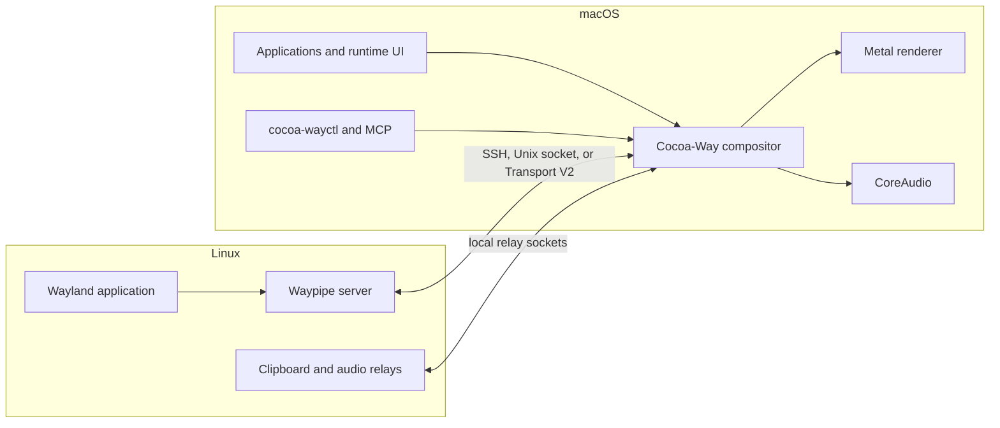

# Cocoa-Way

<div align="center">

[](https://github.com/J-x-Z/cocoa-way/releases)
[](https://github.com/J-x-Z/cocoa-way/actions)
[](https://www.gnu.org/licenses/gpl-3.0)
[](https://www.rust-lang.org/)
[](https://www.apple.com/macos/)
[](https://github.com/rust-unofficial/awesome-rust)
[](https://github.com/jaywcjlove/awesome-mac)

**A native macOS Wayland compositor and Linux application control plane.**

[Demo](#demo) | [Install](#installation) | [Quick start](#quick-start) | [Container mode](#container-mode) | [Architecture](#architecture)

</div>

---

## What is Cocoa-Way?

Cocoa-Way receives the Wayland protocol on macOS and presents Linux applications through a Metal renderer. It can connect to an existing Linux machine with Waypipe or manage local GUI applications through Apple Container, Docker, and OrbStack.

Version 2.0 models the product around three explicit objects:

- **Application profile**: saved image, command, runtime, presentation, audio, mounts, and environment settings.
- **Application instance**: one running profile with its own process, logs, transport, and lifecycle state.
- **Display**: the default compositor window or an isolated display worker assigned to an instance.

This keeps classic SSH and local-socket workflows available while making Apple Container a first-class runtime.

## Demo

[](https://youtu.be/MOZRRifSazY)

## Highlights

| Area | Cocoa-Way 2.0 |
| --- | --- |
| Rendering | Native Metal renderer with Retina scaling and damage-aware SHM uploads |
| Presentation | Desktop mode for compositors and rootless mode for individual xdg-shell applications |
| Runtimes | Apple Container, Docker-compatible engines, OrbStack, SSH, and local Waypipe sockets |
| Displays | Automatic assignment, named displays, and isolated workers for concurrent applications |
| Transport | Apple Container Transport V2 over `--publish-socket`, with a compatibility relay fallback |
| Integration | Bidirectional text clipboard, low-latency CoreAudio forwarding, keyboard, pointer, and gestures |
| Control plane | Native runtime panels, `cocoa-wayctl --json`, diagnostics, tasks, logs, and resource warnings |
| Automation | Optional read-only MCP server and onboarding skill; launch, stop, and deletion remain explicit user actions |

## Installation

### Apple Container (for managed local applications)

Apple Container is a separate Apple runtime and is not bundled with Cocoa-Way. Apple officially supports it on Apple silicon with macOS 26; see its [current requirements](https://github.com/apple/container#requirements). Install it before using Cocoa-Way's managed local application workflow:

1. Download and install the [latest official Apple Container release](https://github.com/apple/container/releases/latest).
2. Open Cocoa-Way and select **Container > Apple Container**.
3. Use **Start System**, then confirm that the Compatibility card reports a running service.

Apple Container 1.0 is supported through a compatibility fallback, but version 1.1 or newer is recommended for the non-root published Unix sockets used by Transport V2. You can verify the runtime manually with:

```bash
container system start
container system status
```

This runtime is optional when Cocoa-Way is used only with SSH, Docker, OrbStack, or an existing local Waypipe socket.

### Homebrew

```bash
brew tap J-x-Z/tap
brew install cocoa-way waypipe-darwin
```

### Release archive

Download the current `.dmg` or `.zip` from [GitHub Releases](https://github.com/J-x-Z/cocoa-way/releases).

### Build from source

```bash
brew install libxkbcommon pixman pkg-config
git clone https://github.com/J-x-Z/cocoa-way.git
cd cocoa-way
cargo build --release
```

`waypipe-darwin` is required on the Mac for transported applications. The Linux host or GUI-ready container image also needs a compatible Waypipe server.

## Quick start

Start Cocoa-Way:

```bash
cocoa-way
```

Connect to an SSH host with the compatibility script:

```bash
./run_waypipe.sh ssh user@linux-host firefox
```

The script also supports local Waypipe/socket workflows and remains independent of Container Mode. The same connection can be created from **Connections > Connect to Machine...**. Saved entries appear in the Connections menu and are stored in `~/.config/cocoa-way/connections.toml`; passwords are never stored.

For a local Apple Container application:

1. Install Apple Container separately, then open **Container > Apple Container** to start and validate it. If it is missing, Cocoa-Way links to Apple's official release page.
2. Open **Container > Applications**.
3. Use **Images** to pull/import an OCI image or build the bundled GUI-ready example.
4. Create an application, choose Desktop or Rootless presentation, and leave Display on Auto unless a stable slot is required.
5. Run **Check**, then **Launch**.
6. Inspect instance status, logs, terminal, files, audio, display assignment, and resource diagnostics in the same panel.

## Presentation modes

### Desktop

Desktop presentation maps Linux windows into one Cocoa-Way compositor window. Use it for nested compositors such as niri or Hyprland and for workflows that intentionally share one Linux desktop surface.

### Rootless

Rootless presentation maps each xdg-toplevel to a separate native macOS window. Native move, resize, minimize, maximize, fullscreen, title updates, popups, and per-surface input are forwarded to the Linux application.

Use Rootless for ordinary Wayland applications such as Foot or Firefox. A desktop compositor is not a rootless application and should remain in Desktop mode.

## Container mode

### Runtime support

- `runtime = "container"` uses Apple's official `container` CLI. Apple Container itself requires supported Apple silicon and macOS versions; Cocoa-Way reports the installed version and missing capabilities in the Apple Container panel.
- `runtime = "docker"` uses the active Docker-compatible context.
- `runtime = "orb"` or `runtime = "orbstack"` uses OrbStack-compatible lifecycle and inventory controls.

The runtime panels expose system state, machines or contexts, containers, images, logs, terminal access, CPU/memory statistics, and guarded lifecycle actions. Cocoa-Way does not require Docker or OrbStack for Apple Container sessions.

### Apple Container transport

On Apple Container 1.0 and newer, Cocoa-Way prefers Transport V2. It publishes a host Unix socket into the container, multiplexes Waypipe streams over that channel, and ties the relay lifetime to the application instance. If socket publishing is unavailable or fails during startup, Cocoa-Way can fall back to the older stdio relay.

Clipboard and audio use dedicated local relays. If the Mac uses a loopback HTTP proxy, Cocoa-Way can expose that proxy to the Apple Container subnet without changing global network settings.

### Application configuration

The GUI writes profiles to `~/.config/cocoa-way/container-sessions.toml`. A representative profile is:

```toml
[[session]]
name = "Niri Desktop"
runtime = "container"
image = "localhost/cocoa-way-niri:latest"
profile = "niri"
command = "niri"
presentation = "desktop"
display = "auto"
audio = true
runtime_args = ["--memory", "4G", "--cpus", "4"]
```

`display = "auto"` uses the built-in display when it is free and allocates an isolated display when necessary. `display = "default"` requires the built-in display. Any other stable name selects a dedicated display slot.

## Local control and MCP

While Cocoa-Way is running it exposes a private Unix-socket control API. `cocoa-wayctl` uses the same validation and event-loop paths as the GUI:

```bash
cocoa-wayctl --json status
cocoa-wayctl --json applications
cocoa-wayctl --json displays
cocoa-wayctl diagnostics "Niri Desktop"
cocoa-wayctl launch "Niri Desktop"
cocoa-wayctl stop "Niri Desktop"
```

`cocoa-way-mcp` is an optional local stdio adapter. Its tools can inspect the environment, suggest trusted image paths, generate reviewable application/connection templates, collect diagnostics, and prepare issue reports. MCP tools are read-only by design; they cannot silently launch applications or delete containers, images, or volumes.

The bundled `skills/cocoa-way-onboarding` workflow guides new users through image selection and profile creation without replacing explicit GUI confirmation.

## Architecture



Dedicated displays run as isolated Cocoa-Way worker processes. A rootless worker may own several native application windows while retaining one runtime/display assignment. Worker telemetry is published back to the control plane without forcing the GUI to redraw continuously.

## Diagnostics and expected behavior

- A static display reports `0.0 fps - idle`; Cocoa-Way renders on demand rather than polling at a fixed frame rate.
- Apple Container does not currently provide guest GPU passthrough to Cocoa-Way. Linux applications may render with Mesa/CPU before their SHM buffers are uploaded to Metal on macOS.
- Rootless mode targets native Wayland xdg-shell clients. X11 applications still require an Xwayland environment inside Linux, and nested desktop compositors should use Desktop mode.
- Registry images are not automatically GUI-ready. They need Waypipe and the requested application; clipboard and audio require the Cocoa-Way helper binaries.

Use the GUI diagnostics page or:

```bash
cocoa-wayctl --json diagnostics "Application Name"
cocoa-wayctl --json logs "Application Name"
```

For classic SSH socket conflicts, `run_waypipe.sh` adds `StreamLocalBindUnlink=yes`. The equivalent manual command is:

```bash
waypipe ssh -o StreamLocalBindUnlink=yes user@host application
```

### Experimental display-synchronized pacing

Cocoa-Way normally limits compositor redraws with its fixed 16 ms timer. An
experimental macOS display-link mode can instead align redraw opportunities to
the main display:

```bash
COCOA_WAY_FRAME_PACING=display-link cocoa-way
```

Only the exact value `display-link` enables the experiment. Omitting the
variable, or setting it to any other value, keeps the fixed timer. The setting
is inherited by dedicated display workers.

This mode is opt-in because a ProMotion display can provide ticks above the
60 Hz refresh rate currently advertised to Wayland clients. It may improve
scrolling latency at the cost of additional CPU and frame throughput. It is not
yet the production default.

## Roadmap

- Continue refining GUI behavior and improving Cocoa-Way's responsiveness and runtime efficiency.
- Continue closing the remaining integration gaps toward a WSLg-like experience for Linux applications on macOS.

## Development

```bash
cargo check --release --all-targets
cargo test --release --all-targets
cargo build --release
```

The repository vendors the Smithay Universal integration used by Cocoa-Way. `waypipe-darwin` remains a separately maintained dependency so its Darwin transport fixes can be tested and released independently.

## Contributing

Bug reports should include the application profile, presentation mode, runtime, Cocoa-Way diagnostics, and the relevant launch log. Please discuss large architectural changes in an issue before opening a pull request.

## License

[GPL-3.0](LICENSE) - Copyright (c) 2024-2026 J-x-Z
